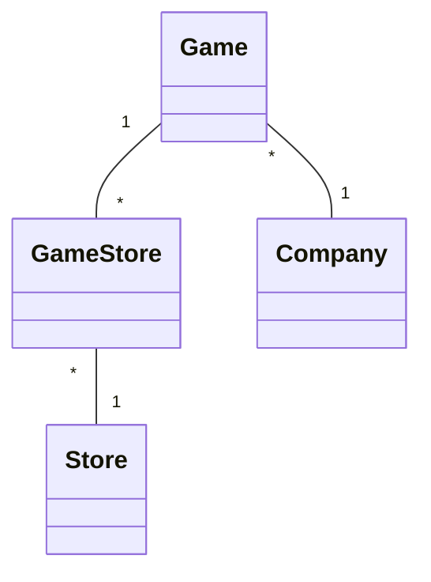

# Project .NET Framework

* Naam: Muhammet Murat
* Studentennummer: 0154865-53
* Academiejaar: 23-24
* Klasgroep: INF202A
* Onderwerp: Bedrijf 1-* Game * - * Store

## Sprint 3

### Beide zoekcriteria ingevuld
```sql

```

### Enkel zoeken op naam
```sql
SELECT "s"."Id", "s"."Address", "s"."Name", "s"."OpeningHour"
FROM "Stores" AS "s"
WHERE "s"."Name" = @__name_0
```

### Enkel zoeken op openinghour
```sql
SELECT "s"."Id", "s"."Address", "s"."Name", "s"."OpeningHour"
FROM "Stores" AS "s"
WHERE "s"."OpeningHour" = @__hour_0
```

### Beide zoekcriteria leeg
```sql
SELECT "s"."Id", "s"."Address", "s"."Name", "s"."OpeningHour"
FROM "Stores" AS "s"
```

## Sprint 4



## Sprint 6

### Nieuwe publisher

#### Request

```http request
POST https://localhost:7204/api/Companies HTTP/1.1
Content-Type: application/json

{"Name": "test", "Address": "content", "YearFounded": "2000-01-01"}
```

#### Response

```http request
HTTP/1.1 201 Created
```