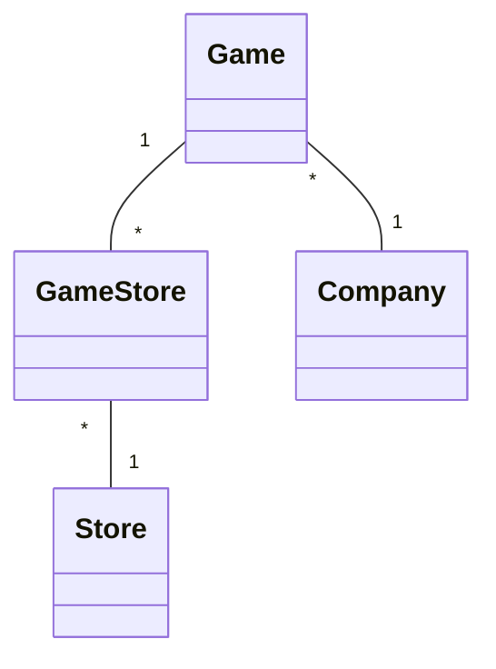
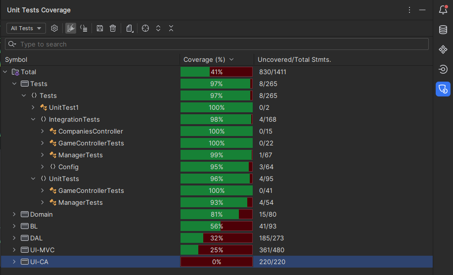

# Project .NET Framework

* Naam: Muhammet Murat
* Studentennummer: 0154865-53
* Academiejaar: 23-24
* Klasgroep: INF202A
* Onderwerp: Bedrijf 1-* Game * - * Store

## Sprint 3

### Beide zoekcriteria ingevuld
```sql

```

### Enkel zoeken op naam
```sql
SELECT "s"."Id", "s"."Address", "s"."Name", "s"."OpeningHour"
FROM "Stores" AS "s"
WHERE "s"."Name" = @__name_0
```

### Enkel zoeken op openinghour
```sql
SELECT "s"."Id", "s"."Address", "s"."Name", "s"."OpeningHour"
FROM "Stores" AS "s"
WHERE "s"."OpeningHour" = @__hour_0
```

### Beide zoekcriteria leeg
```sql
SELECT "s"."Id", "s"."Address", "s"."Name", "s"."OpeningHour"
FROM "Stores" AS "s"
```

## Sprint 4



## Sprint 6

### Nieuwe company

#### Request

```http request
POST https://localhost:7204/api/Companies HTTP/1.1
Content-Type: application/json

{"Name": "test", "Address": "content", "YearFounded": "2000-01-01"}
```

#### Response

```http request
HTTP/1.1 201 Created
```

## Sprint 7

### Users

```
UserName = assassinCreed@example.com, Email = user1@example.com, Password = Student1234! , Role = User

UserName = fifa21@example.com, Email = user2@example.com, Password = Student1234! , Role = User

UserName = cyberpunk2077@example.com, Email = user3@example.com, Password = Student1234! , Role = User

UserName = theWitcher3@example.com, Email = user4@example.com, Password = Student1234! , Role = User

UserName = admin@app.com, Email = admin@app.com, Password = Password1! , Role = Admin
```
#### Request

```http request niet aangemeld
POST https://localhost:7204/api/Companies HTTP/1.1
Content-Type: application/json


{"Name": "test", "Address": "content", "YearFounded": "2000-01-01"}
```

#### Response

```http request
HTTP/1.1 401 Unauthorized
```

#### Request

```http request aangemeld
POST https://localhost:7204/api/Companies HTTP/1.1
Content-Type: application/json
Cookie: .AspNetCore.Identity.Application=CfDJ8Byf-7BLl5BHsW0kdgm_8z6HceNxx0QTSTy5R2ccUKkENv6ETBkbhuIzoe4Q05ShnFyxRa5JJ_NTFp5aa26rlS1LWYhnnNTvBdYdOb898wcgfDy09MT2nwp1a5pZ--TreDCeOqzS3eIOLe98P0ZO0KTmzgob9Df4dlhqWaZL7I4BXmyVEOoTtl2TMAz2evvZeXE2sJLiWko8qYWPpSln7xwVZ435gu-S6V23yNvyykeARdwZ66QdF4R9guCjV1DpkmSqLLPODWrwBRAORa2HiKvba3j55laSbqJKIQ6gpijqmiQUtug678gur0TW0OZw7pL1dGCEHQLw_Oe3uMRLesJTLa3BPdgpXGA3xeYPL1ujV35tztnlqT3h4pSaYWamI-TJqwv9_riKRDd94CXlxACHW-oert4rlHe9nV971nuLYJHdKDwCnHsBoZH3KVLa7DLEq8JGpEzc7yYI_U8GWcyEhfCzJt7xEEcosR49FxY8LZ2HIADrsnHghaxzgni-5vGTMN2go8KB7cpn-3J9UHJ8EHyGGmyFQgeXWoEh7lpzTjPU6pwDMUEzV4i4pN-v2eRjNwt1PDSfb_bNd47z0jumjL9InDEIdyVDKU3Dll5oPrupoFF37l0RWLhuXK-SqFyGSIDeS0ZXP09QlcRFUFlaUj2PKMeCik5Lnop8DYlC45HnkjK-9UJxbRY8yPXXuWTCNce0n0SJRzfoV466GiGoREXBVWT8zVJP-C6k0txYH9HSQkQtmOzc9Z-y_GshExB4JEGXuViq4fxTr4Vh5X_9ovTveE-UpiRpsY0yEWfc3TKC6TgYbhu54fVHziL4IixziOblo0GBiVtJXxzyd6E

{"Name": "test", "Address": "content", "YearFounded": "2000-01-01"}
```

#### Response

```http request
HTTP/1.1 201 Created
```

## Sprint 8

```shell
dotnet test
```


#### authorization requirements
```
Tests.IntegrationTests.GameControllerTests
```

#### verification
```
Tests.UnitTests.ManagerTests
```
#### Links

Tests:
[link](https://gitlab.com/kdg-ti/programmeren-2---.net/23-24/inf202/projecten/muhammet.murat/-/pipelines/1225660217/test_report?job_name=tests)

code coverage rapport:
[link](https://gitlab.com/kdg-ti/programmeren-2---.net/23-24/inf202/projecten/muhammet.murat/-/jobs/6465325411/artifacts/browse/coveragereport/)
